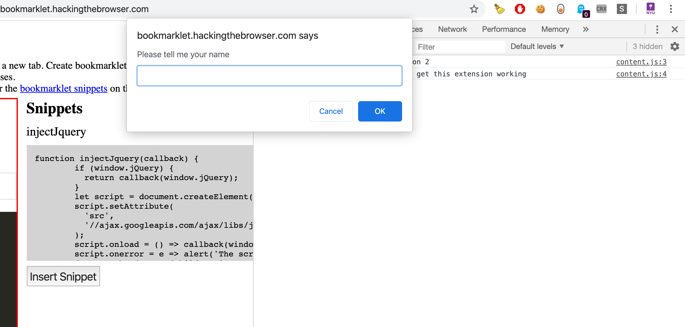
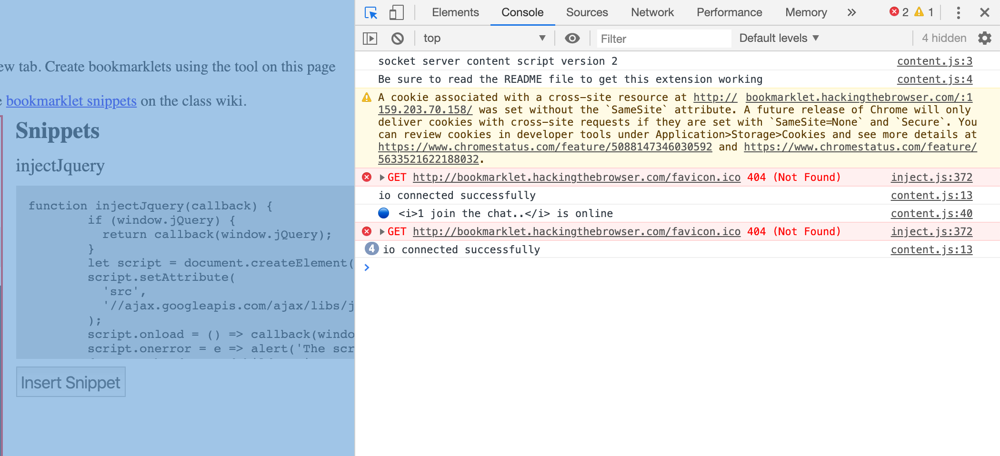
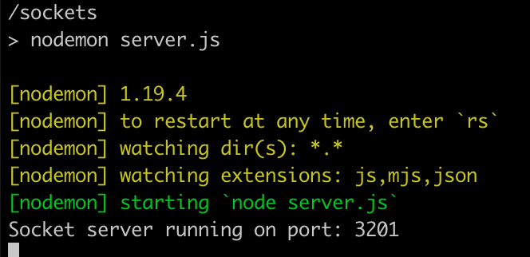
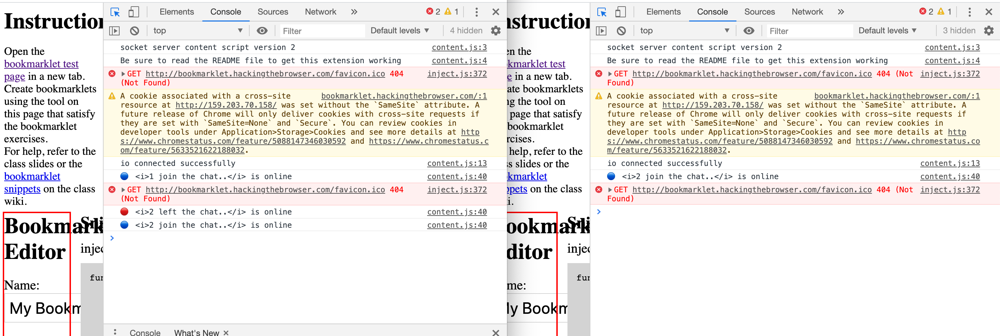

# Group Chat extension

Goal was to use a socket extension to communicate realtime with people - anyone with the extension open can identify them selves and chat.

1. I was able to prompt a user to set a username

2. Once connected, set an online status

3. I was able to have a socket server running on a cloud server. Server.js is being served on a droplet in digitalocean so this extension can be served digitally. In content.js there is an IP address, which is the address of digitalocean. A copy of server.js is sitting there on digital ocean so now, with this extension as many users can join the group chat.

4. Enabling a second user connect from another pc. User 1 and User 2. 

5. This interaction is fairly straight forward in a standard broswer setting but I encountered issues getting it done as an extension; like limitations in getting multiple javascript libraries (jQuery, Socket) to operate in content.js even when included in an array. The only problem is the message is not being sent to multiple people in a group but they can connect, i.e. a connection is there but messages are not functional.
